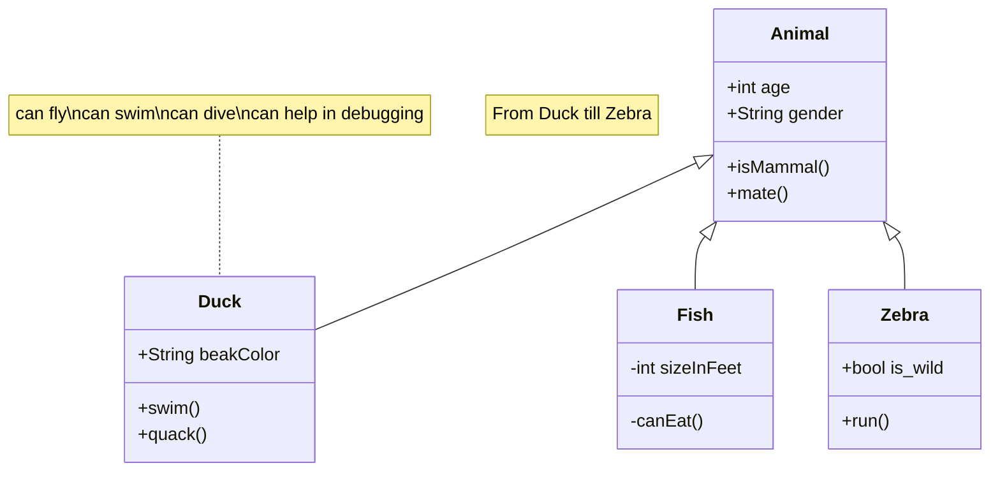

Simple project written in Go, with the next endpoints:

 - /: Return "hello world"
 - /env: List all env variables (json).
 - /redis/status:
 - /mongodb/status:
 - /postgresql/status
 - /s3/status
 - /mysql/status
 - /config/<config_name>
 - /sleep
  

